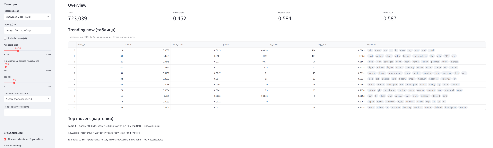
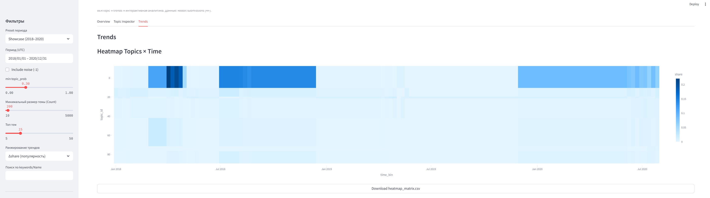

# Social Trends Lab (v2)


**A practical research dashboard for topic modeling + trend analytics on noisy social text.**

This repo contains a **reproducible end‑to‑end pipeline** that:
1) cleans a large social/news corpus,  
2) builds SBERT embeddings,  
3) discovers topics with **BERTopic** (UMAP + HDBSCAN) + topic reduction,  
4) computes **temporal trends**,  
5) serves an **interactive Streamlit dashboard**.

> **Note on data:** raw data and generated artifacts are intentionally **gitignored**. The pipeline regenerates everything locally.

---

## Why this project
- **Realistic data**: noisy, multi-domain text (not “clean tutorial” corpora).
- **End‑to‑end engineering**: configs → pipeline → artifacts → UI bundle → dashboard.
- **Trend research**: “what’s rising / falling” with time bins and ranking modes.
- **Portfolio-ready**: strong focus on interpretability and product-like visualization.

---

## Showcase result (our current “final” profile)
On a ~1M corpus, after preprocess v2:

- **Documents after cleaning:** 723,039  
- **Final topics:** 100 (after reduction)  
- **Noise share:** ~0.452  
- **Topic probability:** median ~0.584; share with `prob ≥ 0.4` ~0.587  

Artifacts (generated locally):
- `artifacts/topics_v2_showcase_100.parquet`
- `artifacts/topics_info_v2_showcase_100.parquet`
- `artifacts/trends_v2_showcase_100.parquet`
- `artifacts/bertopic_model_v2_showcase_100/bertopic.pkl`
- UI bundle in `artifacts/ui/` (see below)

---

## Project structure (canonical)
```
SocialMediaNN/
├─ configs/
│  └─ topics_v2_showcase_100.yaml        # ✅ final “showcase” profile
├─ scripts/
│  ├─ run_pipeline_v2.py                 # ✅ main end-to-end pipeline
│  ├─ export_ui_bundle.py                # ✅ exports artifacts/ui/* for Streamlit
│  ├─ sanity_check_topics.py             # report-only sanity checks (optional)
│  ├─ inspect_raw.py                     # raw dataset sanity checks (optional)
│  ├─ merge_parquets.py                  # merges shards into one parquet (optional)
│  ├─ hf_download_shards.py              # optional: download HF shards
│  └─ download_hf_reddit_sharded.py      # optional: download helper
├─ src/
│  └─ ui/
│     └─ streamlit_app.py                # ✅ Streamlit dashboard (run this)
├─ data/
│  └─ raw/                               # ❌ NOT committed (place your raw parquet here)
└─ artifacts/                            # ❌ NOT committed (generated outputs)
   └─ ui/                                # exported bundle for Streamlit
      ├─ topics.parquet
      ├─ topics_info.parquet
      ├─ trends.parquet
      ├─ topic_examples.parquet
      └─ meta.json
```

**Canonical entrypoints**
- Pipeline: `scripts/run_pipeline_v2.py`
- Final config: `configs/topics_v2_showcase_100.yaml`
- UI: `streamlit run src/ui/streamlit_app.py`

---

## Quickstart

### 1) Create environment
```bash
conda create -n social_api_env python=3.10 -y
conda activate social_api_env
pip install -r requirements.txt
```

### 2) Put raw dataset locally
Place your parquet under `data/raw/` (example):
- `data/raw/reddit_hf_mix_1m.parquet`

This repository does not ship the dataset.

### 3) Run the end-to-end pipeline (v2)
```bash
python scripts/run_pipeline_v2.py --config configs/topics_v2_showcase_100.yaml
```

This generates:
- cleaned posts
- embeddings
- BERTopic model + doc topics
- trends parquet

### 4) Export UI bundle for Streamlit
```bash
python scripts/export_ui_bundle.py \
  --topics artifacts/topics_v2_showcase_100.parquet \
  --info artifacts/topics_info_v2_showcase_100.parquet \
  --trends artifacts/trends_v2_showcase_100.parquet \
  --out_dir artifacts/ui \
  --profile_name topics_v2_showcase_100 \
  --examples_max_topics 80 \
  --examples_per_topic 15 \
  --examples_min_prob 0.30
```

### 5) Launch Streamlit UI
```bash
streamlit run src/ui/streamlit_app.py
```

---

## Streamlit UI: what you can do
- **Overview:** trending topics table + “top movers” cards
- **Topic Inspector:** trend line + high-probability post examples with links
- **Trends:** heatmap Topics×Time (share or z-score) + multi-topic comparison

Filters:
- include/exclude noise topic (-1)
- min topic probability threshold
- time presets and date range
- min topic size
- keyword/name search
- ranking mode: Δshare / growth / last share

---

## Reproducibility notes
- Generated files live in `artifacts/` and are **not committed**.
- The UI reads only `artifacts/ui/*` (a small stable “bundle”).
- If you change configs or code, rerun:
  1) `run_pipeline_v2.py`
  2) `export_ui_bundle.py`
  3) `streamlit_app.py`

---

## Notebooks (recommended)
Keep notebooks minimal and focused:

- `notebooks/00_sanity_and_quality.ipynb`
  - KPI snapshot (docs/topics/noise/prob thresholds)
  - distributions (topic sizes, topic_prob)
  - examples per topic (interpretability)

- `notebooks/01_trends_demo.ipynb`
  - heatmap share/z-score
  - “trending now” top Δshare
  - multi-topic comparison plots
  - short narrative conclusions

---

## Suggested GitHub Topics (tags)
`machine-learning`, `nlp`, `topic-modeling`, `bertopic`, `umap`, `hdbscan`, `sbert`, `sentence-transformers`, `trend-analysis`, `streamlit`, `data-visualization`, `social-media-analytics`, `unsupervised-learning`

---

## Screenshots



---

## License
MIT — see `LICENSE`.

## Acknowledgements
- **BERTopic** (Maarten Grootendorst)
- **Sentence-Transformers**
- **UMAP**, **HDBSCAN**
